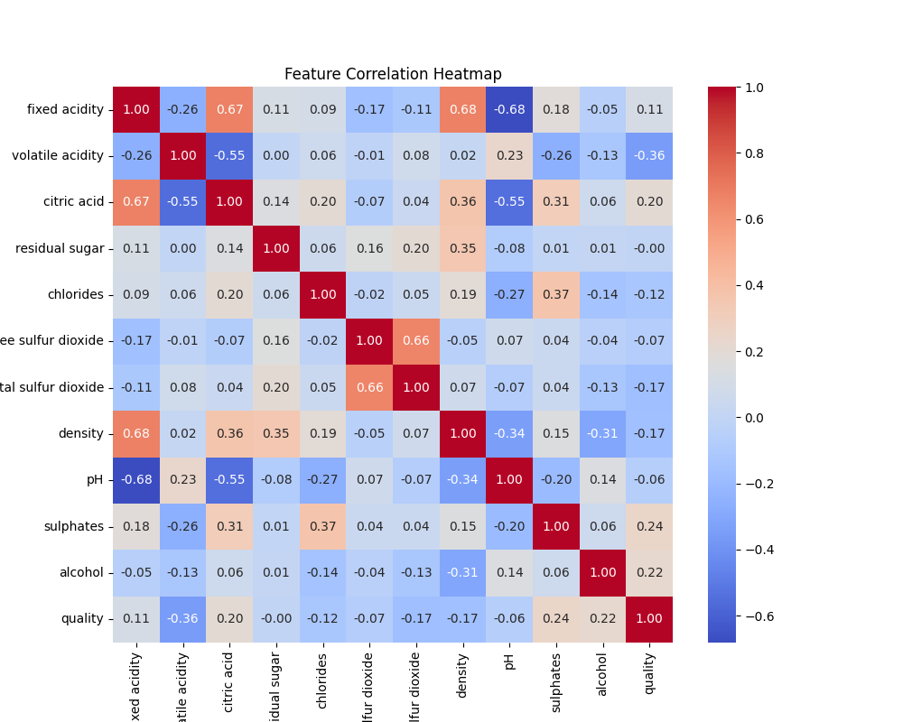
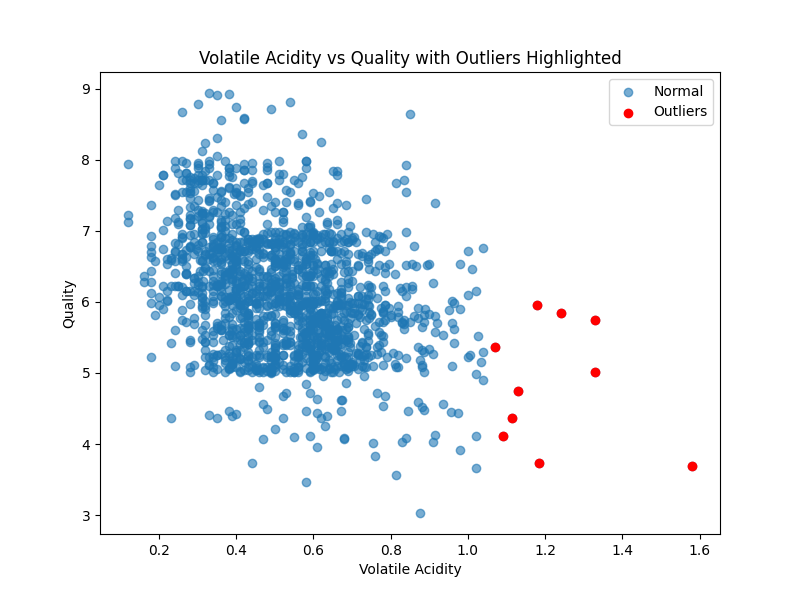

# 🍷Wine Quality Prediction

## 📑 Overview
This project analyses the Red Wine Quality dataset and builds machine learning models to predict wine quality based on physicochemical properties such as acidity, sugar, sulphates and alcohol.

It demonstrates an end-to-end data science workflow:
- Data cleaning (handling duplicates, missing values and outliers)
- Exploratory Data Analysis (EDA)
- Feature Engineering
- Model training (Linear Regression and Random Forest)
- Evaluation and conclusion

## 📂 Project Structure
```
wine-quality-prediction/
├── data/
│ ├── winequality-red.csv
│ └── README.md
├── notebooks/
│ └── analysis.ipynb
├── results/
│ ├── correlation_heatmap.png
│ └── volatile_acidity_outliers.png
├── src/
│ └── utils.py
├── .gitignore
├── .gitattributes
├── LICENSE
├── README.md
└── requirements.txt
```

## 📊 Dataset
The dataset comes from the UCI Machine Learning Repository:
[Wine Quality Data Set](https://archive.ics.uci.edu/dataset/186/wine+quality)
- 1599 samples of red wines
- 11 physicochemical features (fixed acidity, volatile acidity, citric acid, residual sugar, chlorides, free sulphur dioxide, total sulphur dioxide, density, pH, sulphates, alcohol)
- Target variable: quality (integer score 0–10)

## ⚙️ Setup
1. Clone this repository
```
git clone https://github.com/EddChi/wine-quality-prediction.git
cd wine-quality-prediction
```
2. Install dependencies
```
pip install -r requirements.txt
```
3. Download dataset from [Wine Quality Data Set](https://archive.ics.uci.edu/dataset/186/wine+quality) and place `winequality-red.csv` inside the `data/` folder.
4. Open the notebook
```
jupyter notebook notebooks/analysis.ipynb
```

## 📊 Preview of Analysis

### Correlation Heatmap


### Outlier Detection (Volatile Acidity vs Quality)  
  

## 📈 Results  

| Model              | R² (Variance Explained) | RMSE (Prediction Error) |
|--------------------|--------------------------|--------------------------|
| Linear Regression  | 0.31                     | 0.76                     |
| Random Forest      | 0.42                     | 0.68                     |

### 🔍 Key Insights
- **Random Forest outperformed Linear Regression**, capturing non-linear relationships.
- **Alcohol** and **sulphates** were strong positive predictors of wine quality.
- **Volatile acidity** negatively impacted quality, consistent with wine chemistry knowledge.

## 🔮 Future Work
- Hyperparameter tuning (e.g., GridSearchCV for Random Forest).
- Cross-validation for robust evaluation.
- Experiment with boosting algorithms (XGBoost, LightGBM).
- Explore feature scaling and transformations.

## 📜 License

This project is licensed under the [MIT License](LICENSE).